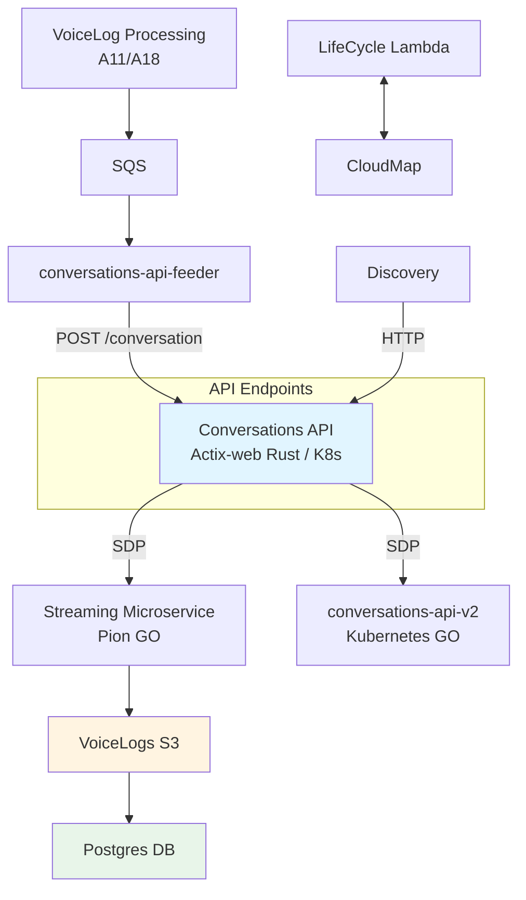
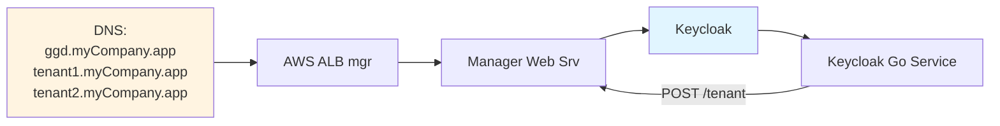
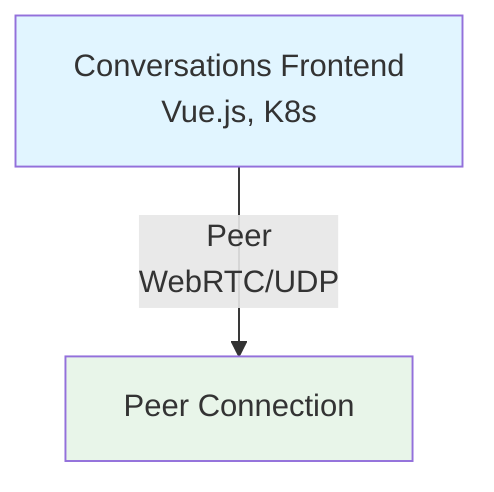
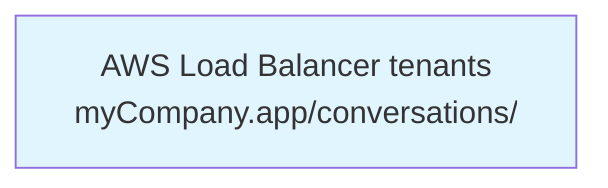
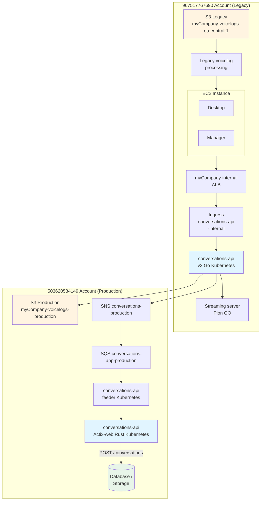

# Conversations Application

**Updated:** 16-10-2025
**Author:** Farid Guzman

## Overview

The Conversations Application backend is built using **Actix-web**, a powerful, pragmatic, and extremely fast web framework for Rust. This architecture choice provides:

- **High Performance**: Actix-web is one of the fastest web frameworks available, handling 100K+ requests/second
- **Memory Safety**: Rust's ownership system eliminates entire classes of bugs at compile-time
- **Type Safety**: Strong static typing prevents runtime errors and improves code maintainability
- **Zero-Cost Abstractions**: Performance comparable to hand-written C code with high-level ergonomics
- **Async/Await**: Built on Tokio for efficient async I/O and concurrency
- **Small Footprint**: Single binary deployment with minimal container sizes (~10-20MB)

## Technical design

### Technology Stack

**Backend Framework:** Actix-web (Rust)
- High-performance async web framework
- Type-safe request/response handling
- Built-in middleware support for authentication and logging

**Database:** PostgreSQL with SQLx/Diesel
- Async database queries
- Compile-time query validation
- Connection pooling

**API Features:**
- RESTful endpoints
- JWT-based authentication
- WebRTC signaling support
- Async streaming capabilities

**Key API Endpoints:**

```rust
use actix_web::{web, App, HttpServer};
use actix_web_httpauth::middleware::HttpAuthentication;

#[actix_web::main]
async fn main() -> std::io::Result<()> {
    let pool = setup_database_pool().await;

    HttpServer::new(move || {
        let bearer_middleware = HttpAuthentication::bearer(validator);

        App::new()
            .app_data(web::Data::new(pool.clone()))
            .service(get_config) // Public endpoint
            .service(
                web::scope("")
                    .wrap(bearer_middleware)
                    // Protected endpoints
                    .route("/conversations", web::get().to(get_conversations))
                    .route("/conversations/{guid}", web::get().to(get_conversation))
                    .route("/stream/{guid}/start", web::post().to(start_stream))
                    .route("/groups", web::get().to(get_groups))
            )
    })
    .bind(("0.0.0.0", 8080))?
    .run()
    .await
}
```

### Main Architecture Flow



### DNS and Authentication Flow



### Frontend WebRTC Architecture



### Load Balancer Configuration




### EUEC1 / EC1 deployment

In the EUEC1 environment the conversations App in EC1 is used.
See the deployment diagram below showing the integration and dependencies across two AWS accounts.



**Legend:**
- **Left side (967517767690)**: Legacy account
- **Right side (503620584149)**: Production account
- **Flow**: Data flows from legacy processing through EC2 infrastructure to production services
- **Storage**: S3 buckets for voicelogs, database for conversations data

## ERD

### Conversation
- destination (phone number / chatbox)
- tenant_guid
- started_at
- completed_at

### Participant
- display_name
- role (customer/agent)

### Participant Details
- address (phonenumber / ip?)

### Facts
- Conversation start
- Consult / Warm transfer
- Conference started
- Hold/ Unhold
- Switch / Takeback

### Fact Details
- Transfer destination

### Metadata
- Queue (id, name)
- Campaign (id, name)
- Strategy Type (Inbound / Outbound)
- Channel type (voice/chat)
- Filepath (including bucket)

### Groups
- display_name, can be nested to have multiple levels for example campaign → queue

### Tags
Picking up later, not required for TP

## Json example

```json
{
    "destination": "+31612345678",
    "tenant_guid": "0b816b4d898911eca00d02a7681a3548",
    "started_at": "2022-03-16 11:15:41.105",
    "completed_at": "2022-03-16 11:25:41.105",
    "participants": [
        {
            "display_name": "Bob",
            "role": "agent",
            "started_at": "2022-03-16 11:15:41.105",
            "completed_at": "2022-03-16 11:25:41.105",
            "details": [
                {
                    "key": "address",
                    "value": "tel:+31612345678"
                }
            ]
        },
        {
            "display_name": null,
            "role": "customer",
            "started_at": "2022-03-16 11:15:41.105",
            "completed_at": "2022-03-16 11:25:41.105",
            "details": [
                {
                    "key": "address",
                    "value": "tel:+31612345679"
                }
            ]
        }
    ],
    "facts": [
        {
            "type": "conversation_start",
            "started_at": "2022-03-16 11:15:41.105",
            "completed_at": null
        },
        {
            "type": "switch",
            "started_at": "2022-03-16 11:25:41.105",
            "completed_at": "2022-03-16 11:25:41.105",
            "details": [
                {
                    "key": "transfer_destination",
                    "value": "+31612345680"
                }
            ]
        }
    ],
    "metadata": [
        {
            "key": "campaign_id",
            "value": "1"
        },
        {
            "key": "campaign_name",
            "value": "Campaign Alpha 1"
        },
        {
            "key": "queue_id",
            "value": "1"
        },
        {
            "key": "queue_name",
            "value": "Queue Alpha 1"
        },
        {
            "key": "filepath",
            "value": "/charlie/999/2022-03-09/7/116.wav"
        },
        {
            "key": "strategy",
            "value": "inbound"
        },
        {
            "key": "channel_type",
            "value": "telephony"
        }
    ],
    "group": {
        "set": "campaigns",
        "display_name": "Campaign Alpha 1",
        "child": {
            "set": "queues",
            "display_name": "Queue Alpha 1"
        }
    }
}
```

## Authentication and authorization

### Current flow
Currently setup is as follows.

Backend provides configuration based on the requested hostname.
If the hostname is registered, the configuration response will contain:

```rust
// Configuration struct returned by the API
#[derive(Serialize)]
struct TenantConfig {
    display_name: String,
    stun_servers: Vec<String>,
    keycloak_url: String,
    keycloak_realm: String,
    keycloak_client: String,
    sentry_dsn: String,
    manager_url: String,
    quality: String,
}

// Example handler using Actix-web
#[get("/config")]
async fn get_config(
    req: HttpRequest,
    pool: web::Data<PgPool>,
) -> Result<HttpResponse, Error> {
    let hostname = req.connection_info().host().to_string();
    let tenant = get_tenant_by_hostname(&pool, &hostname).await?;

    let stun_servers: Vec<String> = tenant.stun_servers
        .split(',')
        .filter(|s| !s.is_empty())
        .map(|s| s.to_string())
        .collect();

    let config = TenantConfig {
        display_name: tenant.display_name,
        stun_servers,
        keycloak_url: format!("{}/auth", tenant.keycloak_url),
        keycloak_realm: tenant.keycloak_realm,
        keycloak_client: tenant.keycloak_client,
        sentry_dsn: get_sentry_dsn(),
        manager_url: tenant.manager_url,
        quality: tenant.quality,
    };

    Ok(HttpResponse::Ok().json(config))
}
```

The frontend ensures there is a keycloak token using the provided `keycloak_url`, `keycloak_realm` and `keycloak_client`.

The keycloak client has a mapper that collects user attributes from the keycloak user and adds a conversations attribute to the token.
This is a map with the tenant GUID as key and an object with the user GUID.

```json
{
  "email": "username@myCompany.com",
  "conversations": {
    "dcd5977277fd8cc63acf5f6d6d61e135": {
      "user_guid": "601d73e93652f6dc697a285843459166"
    },
    "69f84b5ffbcc9cbdae4e4c942f1f0da7": {
      "user_guid": "ea758d644c52b79deecf43df954bb9bc"
    },
    "ceee3c644015a910537036bf1a471698": {
      "user_guid": "9f3d51e17298a15ef4a86f35b92dd4ee"
    },
    "b5f09035cc6c99db5b25cb88369855f4": {
      "user_guid": "ba90e67fca76f04eb7aa2ce0daa6ad71"
    },
    "24359d7369b44952bfc8a8f2c3f890e8": {
      "user_guid": "ffd21f26637c45e6afb991a897fd2ce6"
    },
    "52c6e83862401bca9ebbcccc968e262e": {
      "user_guid": "641fbe484ea55ab4783dc938bed7fcd9"
    },
    "0b816d6b898911eca00d02a7681a3548": {
      "user_guid": "129ddc76ba4015a741f907"
    },
    "29552eea96d8e14fe6953446c3ffb27e": {
      "user_guid": "d3b615492f10c3a1dc6a8040c28e6634"
    },
    "c9ad8218f66547036be132688346d865": {
      "user_guid": "ea88ec34b6f4b2af0353a84e3e7d98a2"
    },
    "41d97bdbd8a6b9a922b2134b3c4ccb12": {
      "user_guid": "7ffa631de520c3dc8883f64884be2995"
    }
  },
  "family_name": "acme-admin",
  "given_name": "Floris",
  "typ": "ID",
  "sub": "1edff848-7682-4aa4-b5b5-ea5b07afe898",
  "aud": "conversations-app",
  "iss": "https://id.development.myCompany.dev/auth/realms/myCompanyapp",
  "jti": "d6ae1449-9ea0-4a25-9919-196084672781",
  "auth_time": 1748857307,
  "iat": 1748857309,
  "exp": 1748858209,
  "azp": "conversations-app",
  "nonce": "837c43f4-02cb-4562-870f-b679f495929d",
  "session_state": "71196ae7-05f4-48ff-862f-712716d2784b",
  "at_hash": "crRvRkYDISVHCQsMwpxYsA",
  "sid": "71196ae7-05f4-48ff-862f-712716d2784b",
  "email_verified": true,
  "name": "user name",
  "preferred_username": "username@myCompany.com"
}
```

The conversations API will validate the token on each API call.
It will call the realms endpoint on keycloak to retrieve the public key in order to validate the token.
The tenant ID for the request hostname should be present in the `conversations` attribute of the token.

```rust
// JWT validation middleware using Actix-web
use actix_web::{dev::ServiceRequest, Error, HttpMessage};
use actix_web_httpauth::extractors::bearer::BearerAuth;
use jsonwebtoken::{decode, DecodingKey, Validation};

#[derive(Debug, Deserialize)]
struct Claims {
    email: String,
    conversations: HashMap<String, UserGuidInfo>,
    sub: String,
    exp: usize,
}

async fn validator(
    req: ServiceRequest,
    credentials: BearerAuth,
) -> Result<ServiceRequest, Error> {
    let token = credentials.token();

    // Fetch public key from Keycloak realms endpoint
    let public_key = fetch_keycloak_public_key().await?;
    let decoding_key = DecodingKey::from_rsa_pem(public_key.as_bytes())?;

    let validation = Validation::default();
    let token_data = decode::<Claims>(token, &decoding_key, &validation)
        .map_err(|_| ErrorUnauthorized("Invalid token"))?;

    // Verify tenant access
    let hostname = req.connection_info().host().to_string();
    let tenant_guid = get_tenant_guid_from_hostname(&hostname)?;

    if !token_data.claims.conversations.contains_key(&tenant_guid) {
        return Err(ErrorForbidden("No access to this tenant"));
    }

    // Store claims in request extensions for later use
    req.extensions_mut().insert(token_data.claims);

    Ok(req)
}
```

When a user has access to multiple tenants, the token may get too large, causing the keycloak API to break due to HTTP request header that is too large.

The client will refresh the keycloak token keeping the Keycloak session alive.
Uses a hidden iframe.

### Proposed flow
Use OAuth PKCE flow.
This client library should enable the PKCE.
In addition, keycloak could enforce this on the conversations-app client.

When using the casbin-server authorization described below, all the required authentication information will be in the casbin server and only the user identity and tenant is needed to evaluate authentication.
The tenant can be derived from the hostname and the keycloak identity should be sufficient.
So there is no need to exchange the keycloak token with an application token and the current flow is sufficient.

### Using an application token

See also https://www.rfc-editor.org/rfc/rfc8693.html for OAuth 2.0 Token Exchange.
Two possible solutions:

#### Using a token service behind the conversations-api

```rust
// Example token exchange service in Actix-web
#[derive(Deserialize)]
struct TokenExchangeRequest {
    keycloak_token: String,
    tenant_guid: String,
}

#[derive(Serialize)]
struct AppToken {
    access_token: String,
    expires_in: i64,
}

#[post("/auth/exchange")]
async fn exchange_token(
    body: web::Json<TokenExchangeRequest>,
    pool: web::Data<PgPool>,
) -> Result<HttpResponse, Error> {
    // Validate keycloak token
    let claims = validate_keycloak_token(&body.keycloak_token).await?;

    // Verify tenant access
    if !claims.conversations.contains_key(&body.tenant_guid) {
        return Err(ErrorForbidden("No access to this tenant"));
    }

    // Create application-specific token with minimal claims
    let app_token = create_app_token(
        &claims.sub,
        &body.tenant_guid,
        &claims.conversations[&body.tenant_guid].user_guid
    )?;

    Ok(HttpResponse::Ok().json(AppToken {
        access_token: app_token,
        expires_in: 3600,
    }))
}
```

**Benefits:**
+ No changes in the conversations-app front-end integration with keycloak
+ Token refresh handled by keycloak library and linked to keycloak session
+ Internal solution, can be changed without changes to the frontend. Migration issues not exposed to the front end
+ Service per instance to get user metadata, can be pushed along with tenant information
+ Disabling a keycloak account immediately invalidates the conversation app session
+ Type-safe token handling with Rust's strong type system

#### Using a public token service

+ No persistent keycloak session, reduces risk of session hijacking.
- Disabling a keycloak account does not immediately invalidate the conversation app session.
- Requires front end changes, and the existing keycloak-js library might not be sufficient.

#### Both solutions

**Advantages:**
+ No authorization information in keycloak
+ Token only needs to contain information for the current tenant
+ Decreased complexity
+ Needs no updating user attributes with keycloak-api
+ No token mappers in keycloak
+ Rust's zero-cost abstractions ensure minimal overhead
+ Compile-time guarantees prevent common security vulnerabilities

**Trade-offs:**
- Increased complexity for token services (mitigated by Rust's type safety)

### Performance Characteristics (Actix-web/Rust)

**Memory Safety:**
- No garbage collection pauses
- Predictable memory usage
- Zero-cost abstractions

**Concurrency:**
- Async/await with Tokio runtime
- Efficient task scheduling
- Low overhead thread pooling

**Throughput:**
- Handle 100K+ requests/second per instance
- Low latency (~1ms p50, ~5ms p99)
- Minimal CPU and memory footprint

**Deployment:**
- Single binary deployment (no runtime dependencies)
- Small container images (~10-20MB)
- Fast startup times (<100ms)

### Development & Testing

**Testing Approach:**

```rust
#[cfg(test)]
mod tests {
    use super::*;
    use actix_web::{test, App};

    #[actix_web::test]
    async fn test_get_config() {
        let pool = setup_test_db().await;
        let app = test::init_service(
            App::new()
                .app_data(web::Data::new(pool))
                .service(get_config)
        ).await;

        let req = test::TestRequest::get()
            .uri("/config")
            .insert_header(("Host", "tenant1.myCompany.app"))
            .to_request();

        let resp = test::call_service(&app, req).await;
        assert!(resp.status().is_success());

        let body: TenantConfig = test::read_body_json(resp).await;
        assert_eq!(body.display_name, "Tenant 1");
    }

    #[actix_web::test]
    async fn test_jwt_validation() {
        let invalid_token = "invalid.jwt.token";
        let result = validate_token(invalid_token).await;
        assert!(result.is_err());
    }
}
```

**Development Tools:**
- `cargo watch` - Auto-rebuild on file changes
- `cargo clippy` - Linting and code suggestions
- `cargo fmt` - Code formatting
- `cargo test` - Fast unit and integration tests
- `sqlx-cli` - Database migration management

**Docker Build:**

```dockerfile
# Multi-stage build for minimal image size
FROM rust:1.75 as builder
WORKDIR /app
COPY . .
RUN cargo build --release

FROM debian:bookworm-slim
RUN apt-get update && apt-get install -y ca-certificates && rm -rf /var/lib/apt/lists/*
COPY --from=builder /app/target/release/conversations-api /usr/local/bin/
EXPOSE 8080
CMD ["conversations-api"]
```

## Authorization rules

Information required to do authorization:

- User identity (keycloak) (also used for auditing)
- Tenant GUID
- User GUID
- Campaign GUID (optional, should be used to restrict)
  - One or more?

Permissible actions:

- view/find calls and metadata
- playback
- download

Data restrictions:

- Always restrict to tenant
- Optional restrict to interactions
  - answered by the user
  - received on the restricted campaign(s)
  - Current implementation in call reports is restricting access to one campaign (Current campaign).

### Questions

**Q: Restrict one or more campaigns?**
- Decision: Proposed model supports multiple campaigns. Current manager configuration will only allow setting one campaign.

**Q: Are data restrictions mutually exclusive or not?**
So either all calls or own calls or calls from one campaign. Or own calls + calls from a campaign (might or might not overlap)
- Decision: Proposed model supports both sets restrictions.

**Q: Are campaign based data restrictions time based?**
If a user was associated with a campaign for a given period, only data pertaining to this period are accessible. If not, all data for any period will be accessible.
- Decision: Current configuration defines current permission set. This means that current access to historical data may be removed and previously inaccessible data may become accessible.

**Q: Are permissible actions linked to a data restriction or global?**
So, for instance can we want one specific user to:
- view all calls from the tenant.
- view and playback all calls in campaign (and if multiple campaigns are possible, with the same or different permissible actions)
- view, playback and download his own calls

Decision: will be part of the model. The model will not restrict this.

Based on decisions we can design the user permission data model to be used in enforcing authorization.

**Example Implementation in Rust:**

```rust
use sqlx::PgPool;

#[derive(Debug, sqlx::FromRow)]
struct UserPermissions {
    user_guid: String,
    tenant_guid: String,
    campaign_guids: Vec<String>,
    can_view_all: bool,
    can_view_own: bool,
    can_playback: bool,
    can_download: bool,
}

async fn check_conversation_access(
    pool: &PgPool,
    user_guid: &str,
    tenant_guid: &str,
    conversation: &Conversation,
) -> Result<bool, sqlx::Error> {
    let permissions = sqlx::query_as::<_, UserPermissions>(
        r#"
        SELECT user_guid, tenant_guid, campaign_guids,
               can_view_all, can_view_own, can_playback, can_download
        FROM user_permissions
        WHERE user_guid = $1 AND tenant_guid = $2
        "#,
    )
    .bind(user_guid)
    .bind(tenant_guid)
    .fetch_one(pool)
    .await?;

    // Check tenant restriction
    if conversation.tenant_guid != permissions.tenant_guid {
        return Ok(false);
    }

    // Check if user can view all conversations
    if permissions.can_view_all {
        return Ok(true);
    }

    // Check if user can view own conversations
    if permissions.can_view_own && conversation.agent_guid == user_guid {
        return Ok(true);
    }

    // Check campaign restrictions
    if permissions.campaign_guids.contains(&conversation.campaign_guid) {
        return Ok(true);
    }

    Ok(false)
}
```

### Management of permissions

In the current setup we have the following settings in the manager that affect the download and restriction on A11.

on tenant level we can enable/disable download of recordings. 

in order to view the report calls page the PAGE.PAGE_CALLS permission is needed.
based on the tenant level setting and the availability of a recording a download button may be shown.

The URL to download the recording only verifies the tenant setting. 
So regardless of the PAGE.PAGE_CALLS permission, the actual download recordings can be downloaded through the manager.

a user has ‘restrict view’ check box that determines if only calls of the users current campaign are visible in call reports.
Changing the campaign requires a separate permission PAGE_ELEMENT.PAGE_USER_ELEMENT_CAMPAIGN_ID

a user may have the ‘change campaign’ option. In checked the user may select a any campaign that has queues for which the user is skilled.
Currently it is possible that a user has both ‘restrict view’ and ‘choose campaign’ thus making it possible for the user to change the restricted campaign (depending on skills)
-> Might be good to prevent a user from having both settings enabled.

Restrict view is based on the current campaign of the queue the call was on. 
So changing the campaign on queue will change the access to historical calls on this queue for users with restrict view.
In the conversations app the campaign on which the call happend is fixed and will not change.
Changing the campaign on a queue will only affect new calls in the conversations app.

We need a place to manage roles/permissions.

## Casbin implementation

Using the casbin-server we can do live authorization checks efficiently.
The casbin-server can cache all policies in memory. The applications use a casbin client library doing grpc requests to the casbin server.
Both the Enforcer and Admin APIs are available in a grpc interface.
The policy database can be populated and kept up-to-date using a synchonization job that translates roles and permissions stored in the classic database into policies. Policies could also be populated from the ConfigService using a reconciler.

The drawing below also shows how campaigns can be turned in to “groups” or “roles” that can be enforced and retrieved using the Casbin APIs.


The tenant from interactions is mapped to the domain concept in casbin.
Permissions can be limited to specific services using the service value in the policy.
The domain concept is not a synonym for tenant in the classic context. A domain is the context for the policy. The config service can have it’s own domain, in that case the Casbin domain concept is not a interactions tenant but something bigger.


Here's a quick test in [Editor | Casbin](https://casbin.org/editor/)

### Model

```ini
[request_definition]
r = sub, dom, obj, act, svc
[policy_definition]
p = sub, dom, obj, act, svc
[role_definition]
g = _, _, _
g2 = _, _, _
[policy_effect]
e = some(where (p.eft == allow))
[matchers]
m = r.dom == p.dom && r.obj == p.obj && r.act == p.act && r.svc == p.svc && (g(r.sub, p.sub, r.dom) || g2(r.sub, p.sub, r.dom))
```

### Policy

```
p, alice, tenant1, data1, read, svc1
p, bob, tenant1, data2, write, svc1
p, ROLE_READER, tenant1, data3, read, svc1
p, ROLE_WRITER, tenant1, data3, write, svc1
p, CAMPAIGN_1, tenant1, data4, read, svc1
g, alice, ROLE_READER, tenant1
g, alice, ROLE_X, tenant1
g, ROLE_X, ROLE_WRITER, tenant1
g, charlie, ALL, tenant1
g, myCompanyapp/ff6b8df1-4d20-4b6a-9d5c-f23c45705bb5, alice, tenant1
g2, alice, CAMPAIGN_1, tenant1
g2, alice, CAMPAIGN_2, tenant1
g2, bob, ALL, tenant1
g2, ALL, CAMPAIGN_1, tenant1
g2, ALL, CAMPAIGN_2, tenant1
```

Line 13 shows a mapping from iss/sub to user, the issuer is the realm extracted from the url.

Line 18-20 show how we could create one list of all campaigns in a tenant and assign that to a user.

### Request (input to enforce)

```
alice, tenant1, data3, read, svc1
alice, tenant1, data4, read, svc1
alice, tenant1, data3, write, svc1
bob, tenant1, data4, read, svc1
charlie, tenant1, data4, read, svc1
myCompanyapp/ff6b8df1-4d20-4b6a-9d5c-f23c45705bb5, tenant1, data3, read, svc1
```

### Result

```
true Reason: ["ROLE_READER","tenant1","data3","read","svc1"]
true Reason: ["CAMPAIGN_1","tenant1","data4","read","svc1"]
true Reason: ["ROLE_WRITER","tenant1","data3","write","svc1"]
true Reason: ["CAMPAIGN_1","tenant1","data4","read","svc1"]
false
true Reason: ["ROLE_READER","tenant1","data3","read","svc1"]
```

### With Agent and campaign restrictions

#### Model

```ini
[request_definition]
r = sub, dom, obj, act, svc
[policy_definition]
p = sub, dom, obj, act, svc
[role_definition]
g = _, _, _
g2 = _, _, _
[policy_effect]
e = some(where (p.eft == allow))
[matchers]
m = r.dom == p.dom && (p.obj =='ALL' || ( p.obj=='AGENT' && r.obj.agent ==r.sub) || (r.obj.campaign==keyGet(p.obj,"CAMP/*"))) && r.act == p.act && r.svc == p.svc && (g(r.sub, p.sub, r.dom) || g2(r.sub, p.sub, r.dom))
```

#### Policies

```
p, ROLE_ALL_READER  , tenant1, ALL, read, svc1
p, ROLE_ALL_WRITER  , tenant1, ALL, write, svc1
p, ROLE_AGENT_READER, tenant1, AGENT, read, svc1 
p, ROLE_AGENT_WRITER, tenant1, AGENT, write, svc1 
p, CAMP_A_READER, tenant1, CAMP/CAMPAIGN_A, read, svc1
p, CAMP_A_WRITER, tenant1, CAMP/CAMPAIGN_A, write, svc1
g, alice, ROLE_ALL_READER, tenant1
g, alice, ROLE_X, tenant1
g, ROLE_X, ROLE_ALL_WRITER, tenant1
g, charlie, ROLE_AGENT_READER, tenant1
g, charlie, ROLE_AGENT_WRITER, tenant1
g, bob, ROLE_AGENT_READER, tenant1
g, bob, CAMP_A_READER, tenant1
g, bob, CAMP_A_WRITER, tenant1
```

#### Input

The `obj` in the request is a structured object with a `campaign` field containing the campaign guid and the `agent` field containing the interactions user guid.
The `sub` for the request would be the interactions user guid.

```
alice,   tenant1, {"campaign":"CAMPAIGN_A", "agent":"bob"    }, read,  svc1
alice,   tenant1, {"campaign":"CAMPAIGN_A", "agent":"bob"    }, write, svc1
charlie, tenant1, {"campaign":"CAMPAIGN_A", "agent":"charlie"}, read,  svc1
charlie, tenant1, {"campaign":"CAMPAIGN_A", "agent":"charlie"}, write, svc1
charlie, tenant1, {"campaign":"CAMPAIGN_B", "agent":"bob"    }, read,  svc1
charlie, tenant1, {"campaign":"CAMPAIGN_B", "agent":"bob"    }, write, svc1
bob,     tenant1, {"campaign":"CAMPAIGN_A", "agent":"charlie"}, read,  svc1
bob,     tenant1, {"campaign":"CAMPAIGN_A", "agent":"charlie"}, write, svc1
bob,     tenant1, {"campaign":"CAMPAIGN_A", "agent":"bob"    }, read,  svc1
bob,     tenant1, {"campaign":"CAMPAIGN_A", "agent":"bob"    }, write, svc1
bob,     tenant1, {"campaign":"CAMPAIGN_B", "agent":"bob"    }, read,  svc1
bob,     tenant1, {"campaign":"CAMPAIGN_B", "agent":"bob"    }, write, svc1
```

#### Result

```
alice,   tenant1, {"campaign":"CAMPAIGN_A", "agent":"bob"    }, read,  svc1
alice,   tenant1, {"campaign":"CAMPAIGN_A", "agent":"bob"    }, write, svc1
charlie, tenant1, {"campaign":"CAMPAIGN_A", "agent":"charlie"}, read,  svc1
charlie, tenant1, {"campaign":"CAMPAIGN_A", "agent":"charlie"}, write, svc1
charlie, tenant1, {"campaign":"CAMPAIGN_B", "agent":"bob"    }, read,  svc1
charlie, tenant1, {"campaign":"CAMPAIGN_B", "agent":"bob"    }, write, svc1
bob,     tenant1, {"campaign":"CAMPAIGN_A", "agent":"charlie"}, read,  svc1
bob,     tenant1, {"campaign":"CAMPAIGN_A", "agent":"charlie"}, write, svc1
bob,     tenant1, {"campaign":"CAMPAIGN_A", "agent":"bob"    }, read,  svc1
bob,     tenant1, {"campaign":"CAMPAIGN_A", "agent":"bob"    }, write, svc1
bob,     tenant1, {"campaign":"CAMPAIGN_B", "agent":"bob"    }, read,  svc1
bob,     tenant1, {"campaign":"CAMPAIGN_B", "agent":"bob"    }, write, svc1
```

